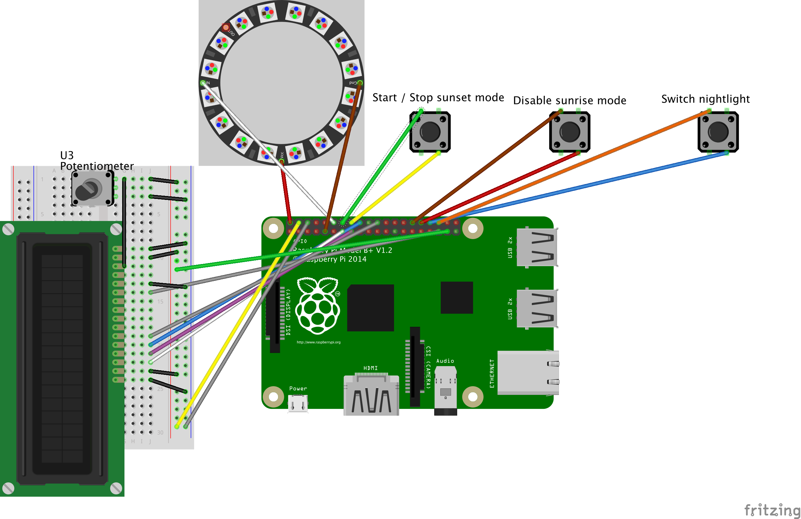

# Prerequisites:
  
## Hardware components
  
  - Raspberry Pi (in my case RP1 model B+)
  - Breadboard (30 rows)
  - Adafruit NeoPixel Ring 24 with Leds
  - Adafruit CharacterLCD



## Raspbian configuration

  Download Raspbian image e.g. Version 9 Stretch and burn image to SD card. 
  
  Now you can boot the Raspberry Pi. Please adjust the localization / time zone on the after booting the fresh installation:
  
  ```sh
  $ sudo raspi-config
  
  # And use the following settings 
  Select 4 / "Localisation Options" 
  Select "I2 Change Timezone"
  Select "Continent" and choose your continent
  Select "Nearest City" and choose your closest city from the list 
  ```

# Software-Installation 
(based on https://learn.adafruit.com/circuitpython-on-raspberrypi-linux?view=all):

**1. Update / Upgrade Raspbian**

`$ sudo apt-get update`

or

`$ sudo apt-get upgrade`

**2. Install Python 3**

`$ sudo apt-get install python3-pip`
  
**3. Enable I2C** 

Check: https://learn.adafruit.com/adafruits-raspberry-pi-lesson-4-gpio-setup/configuring-i2c 

**4. Enable SPI** 

Check: https://learn.adafruit.com/adafruits-raspberry-pi-lesson-4-gpio-setup/configuring-spi

**5. Verifiy I2C and SPI devices via**

`$ ls /dev/i2c* /dev/spi*`
  
**6. Install Raspberry Pi library GPIO**

`$ pip3 install RPI.GPIO`
  
**7. Install blinka library for supporting different python api**

`$ pip3 install adafruit-blinka`
  
**8. Verify blinka installation with new file:**

```python   
# in file blinkatest.py

import board
import digitalio
import busio

print("Hello blinka!")

# Try to great a Digital input
pin = digitalio.DigitalInOut(board.D4)
print("Digital IO ok!")

# Try to create an I2C device
i2c = busio.I2C(board.SCL, board.SDA)
print("I2C ok!")

# Try to create an SPI device
spi = busio.SPI(board.SCLK, board.MOSI, board.MISO)
print("SPI ok!")

print("done!")
```

**9. Setup for LCD usage**

- https://learn.adafruit.com/character-lcds/python-circuitpython

  e.g. via `sudo pip3 install adafruit-circuitpython-charlcd`

**10. Install Apache web server**

`$ sudo apt install apache2 -y`

**11. Install PHP 7.x**

`$ sudo apt install php libapache2-mod-php -y`

**12. Copy source files to Raspberry Pi**

```
Python scripts to /home/pi
-
PHP scripts and further frontend related resources to /var/www/html, respectively var/www/html/data
```


**13. Verify that crontab is installed (also for python)**

`$ sudo pip3 install python-crontab`

**14. Install incron for updating cronjob for triggering python script after changing alarm time**

`$ sudo apt-get install incron`

**15. Change file owner for alarm_time storage file
sudo chown www-data:incron alarm_time.txt**

**16. Define incron for listing on alarm_time.txt file
Open session with user of desire and execute the following commands:**

```sh
$ cd ~
$ incrontab -e

# Add to file
/var/www/html/data/alarms.json IN_MODIFY /home/pi/update_cron.py
```

**16. Ensure proper CHMOD settings for cron update script**
`-rwxr-xr-x`


**17. Add pygame mixer libary for playing sounds**

```
$ sudo pip3 install pygame
# restart after sucessfull installation
$ sudo shutdown -r 0
```


**18. Add (background) service for controlling buttons**

Move service definition to systemd folder

```
$ sudo mv button_control.service /etc/sytemd/system
```

Start background service and enable on boot.
```
$ sudo systemctl start button_control.service
$ sudo systemctl enable button_control.service
```

1. https://www.raspberrypi.org/documentation/linux/usage/systemd.md